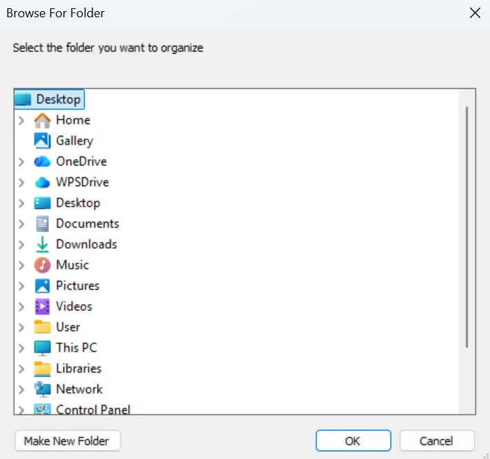

# Clutter Clear

A small Node.js CLI tool that organizes a messy folder by sorting files into subfolders based on their extension (e.g. all `.png` files go into a `PNG/` folder).

## Features
- Opens a native Windows folder picker — no need to type paths manually
- Automatically creates extension-based subfolders (`PNG`, `PDF`, `MP4`, etc.)
- Skips files with no extension
- Safe error handling — logs issues instead of crashing mid-run

## Demo


Running `node clutter.js` opens a native Windows folder picker — no need to type paths manually.

## Requirements
- [Node.js](https://nodejs.org/) installed
- Windows OS (uses PowerShell for the native folder-picker dialog)

## Installation
```bash
git clone https://github.com/JODALS/clutter-clear.git
cd clutter-clear
```

## Usage
```bash
node clutter.js
```
A folder-picker window will open — select the folder you want to organize. The script will then sort every file inside it into subfolders named after their extension.

## How it works
Node.js can't open native OS dialogs on its own, so this script uses `child_process.execSync` to run a small PowerShell script that opens Windows' built-in `FolderBrowserDialog`. The PowerShell script is written to a temporary `.ps1` file (to avoid quote-escaping issues) and deleted after it runs. Once a folder is selected, the script reads every file inside it with `fs.readdirSync`, groups them by extension using `path.extname`, creates a matching subfolder for each extension, and moves each file into it with `fs.renameSync`.

## Limitations
- Windows-only currently (PowerShell dependency for the dialog)
- No undo — back up important folders before running
- Files with no extension are skipped and left untouched

## License
MIT
